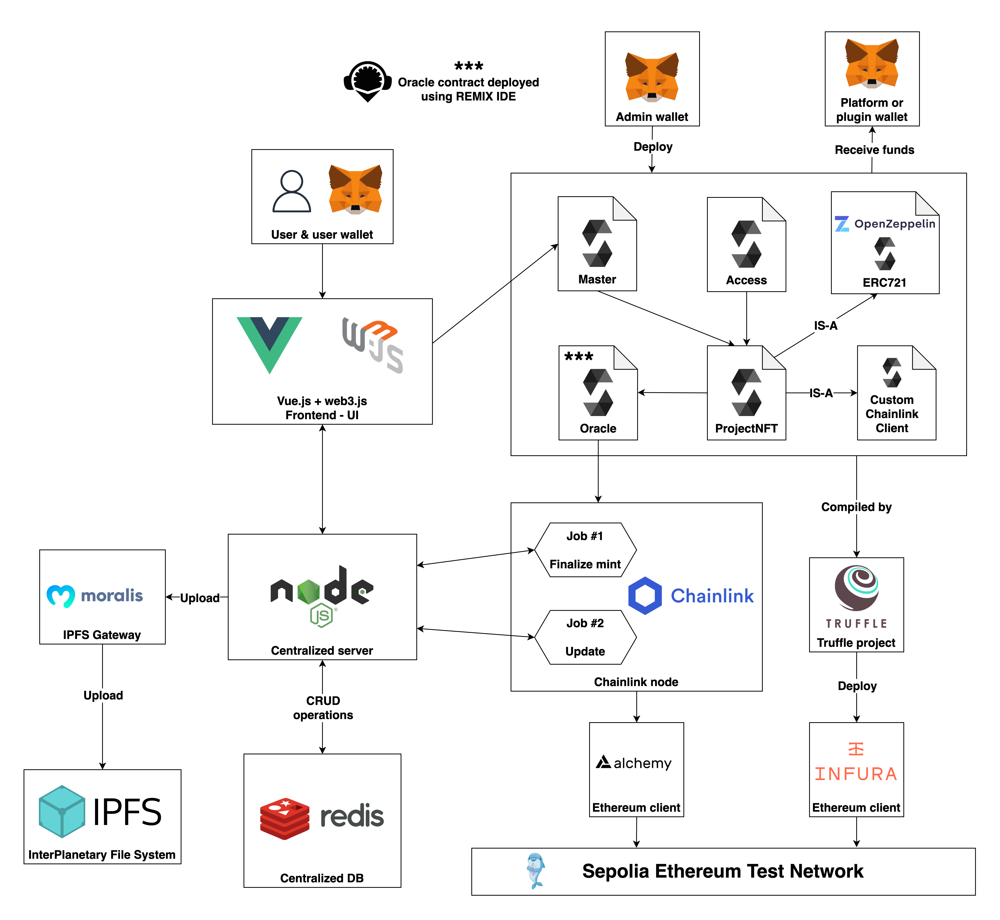
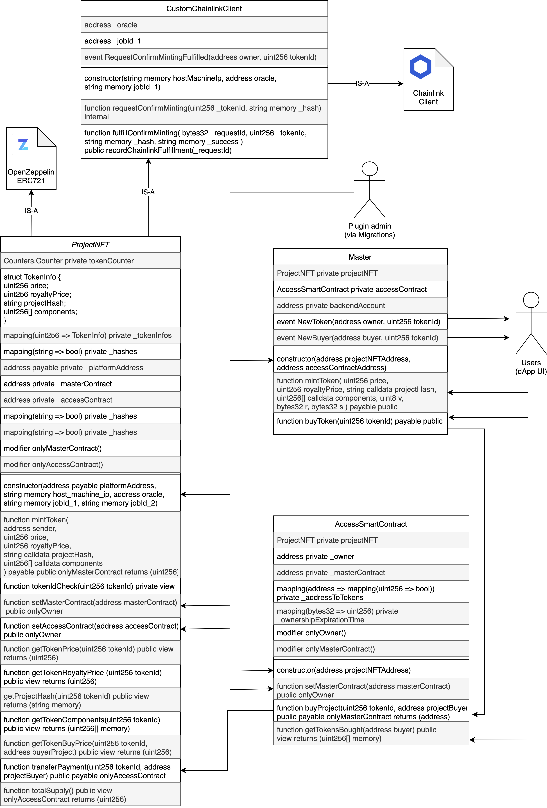
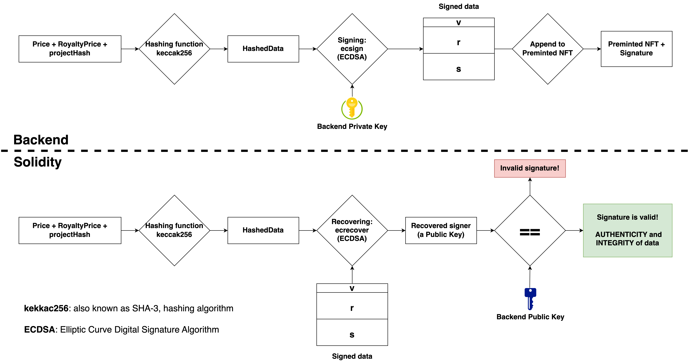

# ProjectChain


ProjectsChain is a plugin developed in order to be integrated with already existing e-shops of industrial designs and is able to grant, using the public blockchain and through smart contracts, the intellectual property of the projects, even without keeping them secret, and a fair royalty distribution between coauthors of the same final project. The straightforward and transparent mechanism developed also will prevent non-payment and miscommunication risks, representing common scenarios among freelancers.

## Architecture diagram




## Technology


 


## UML diagram of smart contracts 



## How to run

There is an example of a .env file in the root of the project named .env.test. You must add your own values to the variables a similar .env file in the root of the project.

### Prerequisites

#### Chainlink mode (recommended)

1. Setup a local Chainlink node by following the instructions in the [Chainlink documentation](https://docs.chain.link/chainlink-nodes/v1/running-a-chainlink-node).

2. Setup the Chainlink jobs on the node by following the instructions in the [Chainlink documentation](https://docs.chain.link/chainlink-nodes/v1/fulfilling-requests).

3. Configure a new job on the Chainlink using tht TOML file named `mint_job.toml` in the `config/chainlink` folder.

4. Update the environment variables in the `.env` file with:
+ the `HOST_MACHINE_IP` of the machine running the Chainlink node
+ the `ORACLE` address of the smart contract `Oracle.sol` deployed on the blockchain
+ the value of `JOBID_1` with the Job ID of the job created in the previous step (without the dashes)

#### Database (Redis) 

1. Install Redis on your machine by runnng the following command:

```bash
docker run -d --name redis-stack \
-p 6379:6379 \
-p 8001:8001 \
-v <path-to-local-folder-to-mount>:/data \
-v <path-to-local-project-folder>/blockchain-project/config/redis/redis.conf:/usr/local/etc/redis/redis.conf \
redis/redis-stack:6.2.6-v7 \
redis-server /usr/local/etc/redis/redis.conf
```
2. Start the Redis server by running the following command:

```sh
redis-server
```

### Compile and deploy the smart contracts

1. Compile the smart contracts by running the following command:

```sh
npm run compile
```

2. Deploy the smart contracts on Ganache or Sepolia by running the following command:

```sh
npm run deploy
```

```sh
npm run deploy-sepolia
```


### Set the chainlink mode on server and frontend

1. Set SEPOLIA_ENABLED variable to true in the head of the file blockchain-project/server/routes/nfts.js

```js
const SEPOLIA_ENABLED = true;
```

2. Set SEPOLIA_ENABLED and CHAINLINK_ENABLE variable to true in the head of the file blockchain-project/frontend/stores/nfts.store.js

```js
const CHAINLINK_ENABLED = true;
const SEPOLIA_ENABLED = true;
```


### Run the server

1. Install the dependencies by running the following command:

```sh
npm install
```

2. Start the server by running the following command:

```sh
npm run server
```


### Run the frontend

1. Run the frontend by running the following command:

```sh
npm run frontend
```

## How to test

1. Run the tests by running the following command:

```sh
npm run test
```


## Digital signature diagram




## Acknowledgements

+ [Chainlink documentation](https://docs.chain.link/)
